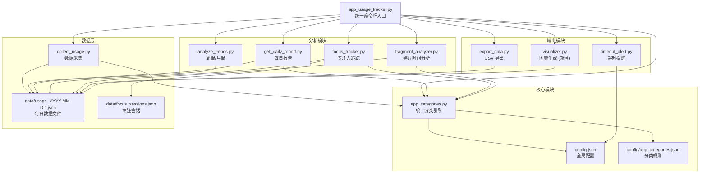

# 技术设计文档：应用使用追踪器功能扩展

## 概述

本设计文档描述了对现有 App Usage Tracker 系统的功能扩展方案。现有系统是一个基于 Python + psutil 的 Windows 应用使用时间追踪工具，已具备进程数据采集、应用分类、时间段分析、每日报告、专注力追踪、碎片时间分析、超时提醒、周报/月报和数据导出等功能的初步实现。

本次扩展的核心目标：
1. 修复现有代码中的语法错误和逻辑缺陷（5 处已知 bug）
2. 统一应用分类系统，消除各模块间的分类逻辑不一致
3. 增强各功能模块的健壮性和可用性
4. 新增可视化图表生成模块（matplotlib）
5. 统一命令行入口，简化用户操作

技术栈：Python 3.x、psutil、matplotlib、Windows Task Scheduler、Windows Toast Notifications

## 架构

### 系统架构图



### 设计原则

1. **统一分类入口**：所有模块通过 `app_categories.py` 的 `classify_app()` 函数获取分类结果，消除各模块自行实现分类逻辑的问题
2. **配置驱动**：阈值、路径、分类规则等均从配置文件读取，避免硬编码
3. **渐进式修复**：优先修复阻塞性 bug，再增强功能，最后新增模块
4. **向后兼容**：保持现有数据文件格式不变，新增字段采用可选方式

## 组件与接口

### 1. 统一分类引擎 (app_categories.py)

现有问题：
- `config/app_categories.json` 文件头部包含 Python 注释，不是合法 JSON
- `scripts/get_daily_report.py` 和 `scripts/collect_usage.py` 各自内联了分类逻辑，与 `app_categories.py` 不一致
- `scripts/focus_tracker.py` 和 `scripts/fragment_analyzer.py` 使用错误的导入路径 `app_usage_tracker.app_categories`
- 分类优先级未定义，同一应用可能匹配多个分类

改造方案：

```python
# app_categories.py

# 分类优先级（从高到低）
CATEGORY_PRIORITY = ["开发", "工作", "社交", "娱乐", "系统", "其他"]

def classify_app(app_name: str) -> tuple[str, str]:
    """
    统一分类接口
    Args:
        app_name: 进程名称
    Returns:
        (分类名称, 颜色图标)
    """
    ...

def add_app_to_category(category: str, app_name: str) -> bool:
    """添加应用到指定分类并持久化"""
    ...

def remove_app_from_category(category: str, app_name: str) -> bool:
    """从指定分类移除应用并持久化"""
    ...

def load_categories() -> dict:
    """加载分类配置"""
    ...

def save_categories(categories: dict) -> None:
    """保存分类配置到 JSON 文件"""
    ...
```

### 2. 数据采集模块 (scripts/collect_usage.py)

改造要点：
- 从 `config.json` 读取 `interval_minutes`、`top_processes`、`exclude_system` 配置
- 使用统一分类引擎替代内联分类逻辑
- 当 `exclude_system=true` 时过滤系统进程
- 自动创建数据目录

```python
def collect(config: dict = None) -> None:
    """
    执行一次数据采集
    Args:
        config: 可选配置覆盖，默认从 config.json 读取
    """
    ...

def get_process_usage(top_n: int, exclude_system: bool) -> list[dict]:
    """
    获取进程使用数据
    Args:
        top_n: 保留的进程数量
        exclude_system: 是否排除系统进程
    Returns:
        Usage_Record 列表
    """
    ...
```

### 3. 每日报告模块 (scripts/get_daily_report.py)

现有问题：
- 第 248 行存在语法错误：`if total_focus = sum(...)` 应为 `total_focus = sum(...); if total_focus < 120:`
- 使用内联分类逻辑

改造要点：
- 修复语法错误
- 使用统一分类引擎
- 报告包含完整的 8 个部分：总览、分类汇总、Top 10 应用、时间块分布、专注力分析、碎片时间分析、空闲时间检测、建议

```python
def generate_report(date_str: str = None) -> str:
    """
    生成每日报告
    Args:
        date_str: 日期字符串 YYYY-MM-DD，默认今天
    Returns:
        报告文本
    """
    ...

def analyze_time_blocks(records: list) -> dict:
    """分析时间块分布，标记高效/低效时段"""
    ...

def generate_suggestions(category_stats: dict, focus_sessions: list) -> list[str]:
    """基于数据生成改进建议"""
    ...
```

### 4. 超时提醒模块 (scripts/timeout_alert.py)

改造要点：
- 从 `config/timeout_alerts.json` 加载配置，不存在时使用默认值
- 同一应用同一天仅发送一次通知
- 支持 `--check` 立即检查、`--add`/`--remove` 管理规则

接口保持现有设计，无需大改。

### 5. 专注力追踪模块 (scripts/focus_tracker.py)

现有问题：
- 导入路径错误 `from app_usage_tracker.app_categories import classify_app`
- 专注度分数计算中使用"浏览器"分类，但统一分类中应使用"工作"和"开发"

改造要点：
- 修复导入路径
- 专注度分数 = 工作/开发类应用时长 / 总时长 × 100
- 支持番茄钟计时，记录到 `data/focus_sessions.json`
- 专注阈值可配置（默认 25 分钟）

```python
def calculate_focus_score(records: list) -> tuple[float, str]:
    """
    计算专注度分数
    Returns:
        (分数 0-100, 状态标签)
        >= 80: 高度专注
        60-79: 较为专注
        40-59: 注意力分散
        < 40: 休闲模式
    """
    ...

def detect_focus_sessions(records: list, threshold_min: int = 25) -> list[dict]:
    """检测专注时段"""
    ...
```

### 6. 碎片时间分析模块 (scripts/fragment_analyzer.py)

现有问题：
- 导入路径错误

改造要点：
- 修复导入路径
- 碎片阈值从 `config.json` 的 `fragment_time_threshold_minutes` 读取
- 碎片化指数 = 活跃小时数 / 总记录数

```python
def analyze_fragments(records: list, short_threshold: int = 10, medium_threshold: int = 30) -> dict:
    """
    分析碎片时间
    Returns:
        {'short': [...], 'medium': [...], 'long': [...]}
    """
    ...

def calculate_fragment_stats(records: list) -> dict:
    """
    计算碎片化统计
    Returns:
        {'active_hours', 'total_records', 'fragmentation_index', 'avg_records_per_hour'}
    """
    ...
```

### 7. 周报/月报模块 (scripts/analyze_trends.py)

改造要点：
- 周报聚合 7 天数据并与上周对比
- 月报聚合本月数据并与上月对比
- 展示数据量变化百分比和 Top 5 应用排名变化
- 无对比数据时仅展示当前周期

```python
def generate_weekly_report() -> str:
    """生成周报"""
    ...

def generate_monthly_report() -> str:
    """生成月报"""
    ...

def analyze_trend(this_data: list, last_data: list) -> dict:
    """
    分析趋势变化
    Returns:
        {'this_total', 'last_total', 'change_pct', 'this_top5', 'last_top5'}
    """
    ...
```

### 8. 数据导出模块 (scripts/export_data.py)

现有问题：
- `export_monthly_csv` 函数中字典字面量缺少右括号（语法错误）

改造要点：
- 修复语法错误
- 使用 `utf-8-sig` 编码确保 Excel 正确显示中文
- 支持单日、周、月导出

### 9. 可视化模块 (scripts/visualizer.py) — 新增

```python
def generate_category_pie(records: list, output_path: Path) -> Path:
    """
    生成分类使用时长饼图
    Args:
        records: Usage_Record 列表
        output_path: 输出 PNG 路径
    Returns:
        生成的文件路径
    """
    ...

def generate_hourly_bar(records: list, output_path: Path) -> Path:
    """生成每小时活跃度柱状图"""
    ...

def generate_weekly_trend(dates: list[str], output_path: Path) -> Path:
    """生成周趋势折线图（每日总使用时长变化）"""
    ...

def setup_chinese_font() -> None:
    """配置 matplotlib 中文字体（SimHei / Microsoft YaHei）"""
    ...
```

### 10. 统一命令行入口 (app_usage_tracker.py)

支持的命令：

| 命令 | 说明 | 对应模块 |
|------|------|----------|
| `collect` | 执行数据采集 | collect_usage.py |
| `daily` | 生成每日报告 | get_daily_report.py |
| `weekly` | 生成周报 | analyze_trends.py |
| `monthly` | 生成月报 | analyze_trends.py |
| `focus` | 专注力分析 | focus_tracker.py |
| `fragments` | 碎片时间分析 | fragment_analyzer.py |
| `export` | 数据导出 (CSV) | export_data.py |
| `categories` | 管理应用分类 | app_categories.py |
| `timeout` | 超时提醒管理 | timeout_alert.py |
| `chart` | 生成可视化图表 | visualizer.py |
| `help` | 显示帮助信息 | — |

改造要点：
- 新增 `timeout` 和 `chart` 命令
- 确保所有子模块导入路径正确
- 未知命令或无参数时输出帮助信息


## 数据模型

### Usage_Record（使用记录）

每次采集产生的单条记录，存储在 `data/usage_YYYY-MM-DD.json` 中：

```json
{
  "timestamp": "2024-01-15 14:00:00",
  "hour": 14,
  "Name": "chrome.exe",
  "Category": "工作",
  "CPU": 2.5,
  "MemoryMB": 512.3,
  "DurationMinutes": 120.5
}
```

| 字段 | 类型 | 说明 |
|------|------|------|
| timestamp | string | 采集时间 YYYY-MM-DD HH:MM:SS |
| hour | int | 小时 (0-23) |
| Name | string | 进程名称 |
| Category | string | 分类标签 |
| CPU | float | CPU 使用率 (%) |
| MemoryMB | float | 内存使用量 (MB) |
| DurationMinutes | float | 运行时长 (分钟) |

### 每日数据文件 (data/usage_YYYY-MM-DD.json)

```json
{
  "date": "2024-01-15",
  "records": [ /* Usage_Record 数组 */ ]
}
```

### Focus_Session（专注会话）

存储在 `data/focus_sessions.json` 中：

```json
{
  "sessions": [
    {
      "date": "2024-01-15",
      "duration": 25,
      "timestamp": "2024-01-15T14:30:00"
    }
  ],
  "daily_stats": {}
}
```

### 分类配置 (config/app_categories.json)

修复后的合法 JSON 格式：

```json
{
  "开发": {
    "color": "🟣",
    "apps": ["python", "java", "node", "npm", "git", "docker", "idea64", "pycharm", "webstorm", "sublime", "gitkraken"]
  },
  "工作": {
    "color": "🔵",
    "apps": ["chrome", "msedge", "firefox", "vscode", "code", "notepad++", "powershell", "cmd", "DingTalk", "钉钉", "企业微信", "飞书", "outlook", "teams", "slack", "zoom"]
  },
  "社交": {
    "color": "🟡",
    "apps": ["微信", "WeChat", "QQ", "Telegram", "Discord", "WhatsApp"]
  },
  "娱乐": {
    "color": "🔴",
    "apps": ["Spotify", "网易云音乐", "vlc", "Steam", "epic", "bilibili", "PotPlayer"]
  },
  "系统": {
    "color": "⚪",
    "apps": ["explorer", "System", "svchost", "RuntimeBroker", "csrss", "services"]
  }
}
```

注意：分类优先级按 JSON 中的键顺序决定（开发 > 工作 > 社交 > 娱乐 > 系统 > 其他）。

### 超时配置 (config/timeout_alerts.json)

```json
{
  "chrome": 120,
  "微信": 60,
  "QQ": 60,
  "抖音": 30,
  "bilibili": 60
}
```

### 全局配置 (config.json)

```json
{
  "interval_minutes": 60,
  "top_processes": 50,
  "exclude_system": true,
  "fragment_time_threshold_minutes": 5,
  "focus_threshold_minutes": 25,
  "data_dir": "data",
  "app_categories": { /* 向后兼容，优先使用 config/app_categories.json */ }
}
```


## 正确性属性 (Correctness Properties)

*属性（Property）是指在系统所有合法执行中都应成立的特征或行为——本质上是对系统应做什么的形式化陈述。属性是人类可读规格说明与机器可验证正确性保证之间的桥梁。*

### Property 1: 分类优先级一致性

*对于任意*进程名称，若该名称同时匹配"开发"和"工作"两个分类的关键词，`classify_app()` 应返回优先级更高的分类（开发 > 工作 > 社交 > 娱乐 > 系统 > 其他）。

**Validates: Requirements 2.2**

### Property 2: 分类规则持久化往返

*对于任意*合法的分类名称和应用名称，调用 `add_app_to_category(category, app_name)` 后再调用 `classify_app(app_name)`，应返回该分类名称。

**Validates: Requirements 2.3**

### Property 3: 未匹配应用默认分类

*对于任意*不包含任何已知分类关键词的随机字符串，`classify_app()` 应返回 `("其他", "⚪")`。

**Validates: Requirements 2.5**

### Property 4: 系统进程过滤

*对于任意*包含系统类和非系统类进程的记录列表，当 `exclude_system=True` 时，采集结果中不应包含任何 Category 为"系统"的记录。

**Validates: Requirements 3.5**

### Property 5: 每日报告包含所有必需部分

*对于任意*非空的 Usage_Record 列表，生成的每日报告文本应包含以下 8 个部分的标题关键词：总览、分类汇总、Top 10、时间块分布、专注力分析、碎片时间、空闲时间、建议。

**Validates: Requirements 4.1**

### Property 6: 报告建议与数据一致性

*对于任意*一组 Usage_Record，当工作/开发类应用时长占比低于 30% 时，报告建议部分应包含增加专注时间的提示；当占比高于 60% 时，应包含效率较高的正面反馈。

**Validates: Requirements 4.5**

### Property 7: 时间块映射完备性与统计正确性

*对于任意*小时值 h（0 ≤ h ≤ 23），`get_time_block(h)` 应返回 7 个预定义时间块之一；且*对于任意*一组 Usage_Record，每个时间块的活跃记录数应等于该时间块对应小时范围内的记录数之和。

**Validates: Requirements 5.1, 5.2**

### Property 8: 时间块效率标记

*对于任意*时间块分析结果，若该时间块中工作/开发类应用占比超过 60%，则应标记为"高效时段"；若社交/娱乐类应用占比超过 50%，则应标记为"低效时段"。

**Validates: Requirements 5.3, 5.4**

### Property 9: 超时检测正确性

*对于任意*应用及其配置的超时阈值，当该应用的运行时长超过阈值时，`check_app_timeouts()` 的返回结果中应包含该应用；当运行时长未超过阈值时，不应包含。

**Validates: Requirements 6.3**

### Property 10: 超时通知去重（幂等性）

*对于任意*应用，在同一天内多次调用超时检查，该应用的通知最多只应触发一次。

**Validates: Requirements 6.4**

### Property 11: 超时规则持久化往返

*对于任意*应用名称和阈值，调用添加规则后加载配置，应包含该规则；调用移除规则后加载配置，应不包含该规则。

**Validates: Requirements 6.5**

### Property 12: 专注度分数计算与标签

*对于任意*一组 Usage_Record，专注度分数应等于 (工作类+开发类应用时长 / 总时长) × 100，且分数 ≥ 80 标记为"高度专注"，60-79 为"较为专注"，40-59 为"注意力分散"，< 40 为"休闲模式"。

**Validates: Requirements 7.3, 7.4**

### Property 13: 专注会话仅包含工作/开发类应用

*对于任意*一组 Usage_Record，检测到的 Focus_Session 中涉及的应用应全部属于"工作"或"开发"分类。

**Validates: Requirements 7.1, 7.2**

### Property 14: 碎片时间三级分类

*对于任意*应用的总使用时长，应被归入且仅归入以下三级之一：短碎片（< 10 分钟）、中碎片（10-30 分钟）、长使用（> 30 分钟）。

**Validates: Requirements 8.1, 8.3**

### Property 15: 碎片化指数计算

*对于任意*非空的 Usage_Record 列表，碎片化指数应等于 活跃小时数 / 总记录数。

**Validates: Requirements 8.2**

### Property 16: 趋势变化百分比计算

*对于任意*两组数据（本期和上期），变化百分比应等于 (本期总量 - 上期总量) / 上期总量 × 100；当上期总量为 0 时，变化百分比应为 0。

**Validates: Requirements 9.3**

### Property 17: CSV 导出往返

*对于任意*一组 Usage_Record，导出为 CSV 后再读取回来，每条记录的 Name、Category、CPU、MemoryMB、DurationMinutes 字段值应与原始数据一致，且 CSV 文件应使用 utf-8-sig 编码。

**Validates: Requirements 10.1, 10.4**

### Property 18: 图表文件生成

*对于任意*包含至少两个不同分类的非空 Usage_Record 列表，调用图表生成函数后，指定路径应存在一个大小 > 0 的 PNG 文件。

**Validates: Requirements 11.4**

### Property 19: 未知命令输出帮助

*对于任意*不在已知命令列表中的字符串作为命令参数，系统应输出帮助信息（包含所有可用命令的列表）。

**Validates: Requirements 12.3**

## 错误处理

### 错误处理策略

| 场景 | 处理方式 |
|------|----------|
| 数据文件不存在 | 输出明确提示信息，返回 None 或空结果 |
| 数据目录不存在 | 自动创建目录（`mkdir(parents=True, exist_ok=True)`） |
| 配置文件不存在 | 使用内置默认配置 |
| 配置文件 JSON 解析失败 | 输出警告，回退到默认配置 |
| psutil 进程访问被拒绝 | 静默跳过该进程（`except AccessDenied`） |
| psutil 进程已消失 | 静默跳过（`except NoSuchProcess`） |
| matplotlib 中文字体不可用 | 尝试多个备选字体（SimHei → Microsoft YaHei → sans-serif），输出警告 |
| 图表数据不足 | 输出提示信息，不抛出异常，返回 None |
| CSV 导出目标路径无写权限 | 捕获 PermissionError，输出错误提示 |
| Windows Toast 通知发送失败 | 捕获异常，输出错误到控制台，不中断程序 |
| 命令行参数无效 | 输出帮助信息并退出 |

### 关键原则

1. **不崩溃**：所有模块在遇到异常时应优雅降级，输出有意义的错误信息
2. **数据安全**：写入文件前确保目录存在；写入失败不应损坏已有数据
3. **用户友好**：错误提示使用中文，包含 emoji 图标，指明可能的解决方案

## 测试策略

### 双重测试方法

本项目采用单元测试 + 属性测试的双重测试策略：

- **单元测试**：验证具体示例、边界情况和错误条件
- **属性测试**：验证跨所有输入的通用属性

两者互补，共同提供全面的测试覆盖。

### 属性测试配置

- **测试库**：[Hypothesis](https://hypothesis.readthedocs.io/)（Python 属性测试标准库）
- **最小迭代次数**：每个属性测试至少运行 100 次
- **标签格式**：`# Feature: usage-tracker-extensions, Property {number}: {property_text}`
- **每个正确性属性对应一个属性测试**

### 单元测试范围

单元测试聚焦于：
- 需求 1 中的 5 个 bug 修复验证（模块导入、语法错误、JSON 格式）
- 配置文件加载的边界情况（文件不存在、格式错误）
- 日期参数处理（无效日期、无数据日期）
- 可视化模块的图表生成（空数据、单分类数据）
- 命令行入口的命令路由

### 属性测试范围

属性测试覆盖上述 19 个正确性属性，重点包括：
- 分类引擎的优先级、默认值、往返一致性（Property 1-3）
- 数据过滤逻辑（Property 4）
- 报告生成的完整性和一致性（Property 5-8）
- 超时检测和去重逻辑（Property 9-11）
- 专注度和碎片化的数学计算（Property 12-16）
- CSV 导出的数据完整性（Property 17）

### 测试文件结构

```
tests/
├── test_classifier.py          # Property 1-3, 单元测试
├── test_collector.py           # Property 4, 单元测试
├── test_reporter.py            # Property 5-8, 单元测试
├── test_timeout.py             # Property 9-11, 单元测试
├── test_focus.py               # Property 12-13, 单元测试
├── test_fragment.py            # Property 14-15, 单元测试
├── test_trends.py              # Property 16, 单元测试
├── test_exporter.py            # Property 17, 单元测试
├── test_visualizer.py          # Property 18, 单元测试
└── test_cli.py                 # Property 19, 单元测试
```

### Hypothesis 策略示例

```python
from hypothesis import given, settings, strategies as st

# 生成随机 Usage_Record
usage_record = st.fixed_dictionaries({
    'timestamp': st.text(min_size=19, max_size=19),
    'hour': st.integers(min_value=0, max_value=23),
    'Name': st.text(min_size=1, max_size=50),
    'Category': st.sampled_from(['工作', '开发', '社交', '娱乐', '系统', '其他']),
    'CPU': st.floats(min_value=0, max_value=100),
    'MemoryMB': st.floats(min_value=0, max_value=65536),
    'DurationMinutes': st.floats(min_value=0, max_value=1440)
})

@settings(max_examples=100)
@given(records=st.lists(usage_record, min_size=1, max_size=50))
def test_fragmentation_index(records):
    """Feature: usage-tracker-extensions, Property 15: 碎片化指数计算"""
    stats = calculate_fragment_stats(records)
    active_hours = len(set(r['hour'] for r in records))
    expected = active_hours / len(records)
    assert abs(stats['fragmentation_index'] - round(expected, 3)) < 0.001
```
