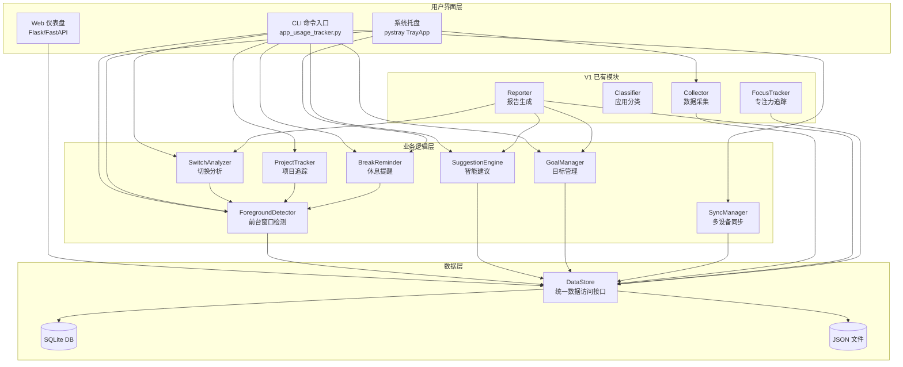
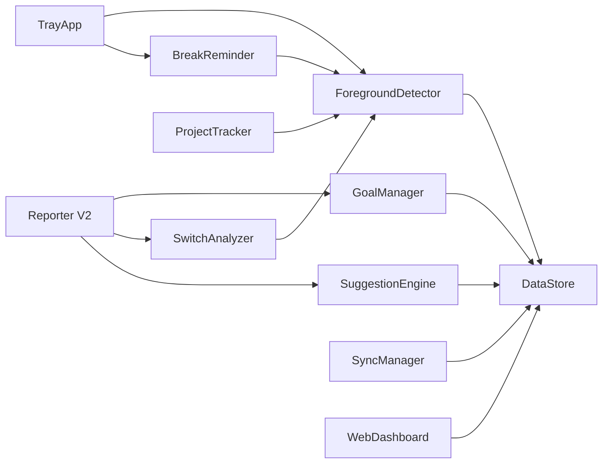

# 技术设计文档：App Usage Tracker V2 — 十大扩展功能

## 概览

本设计文档描述 App Usage Tracker V2 的十大扩展功能的技术实现方案。V2 在 V1 的基础上引入前台窗口检测、目标管理、切换分析、Web 仪表盘、多设备同步、项目追踪、智能建议、休息提醒、SQLite 数据库后端和系统托盘常驻等功能。

核心设计原则：
- **渐进式迁移**：通过 DataStore 统一接口抽象存储层，支持 JSON/SQLite 双后端，V1 功能无缝兼容
- **模块化架构**：每个新功能作为独立模块，通过统一入口 `app_usage_tracker.py` 注册命令
- **优雅降级**：可选依赖（pywin32、pystray、Flask）缺失时回退到基础模式并输出提示
- **零外部服务依赖**：所有数据本地存储，同步功能支持本地文件夹或 S3（可选）

## 架构

### 系统架构图



### 模块依赖关系



### 文件结构（新增部分）

```
app-usage-tracker/
├── scripts/
│   ├── foreground_detector.py    # 需求1: 前台窗口检测
│   ├── goal_manager.py           # 需求2: 目标管理
│   ├── switch_analyzer.py        # 需求3: 切换分析
│   ├── web_dashboard.py          # 需求4: Web 仪表盘
│   ├── sync_manager.py           # 需求5: 多设备同步
│   ├── project_tracker.py        # 需求6: 项目追踪
│   ├── suggestion_engine.py      # 需求7: 智能建议
│   ├── break_reminder.py         # 需求8: 休息提醒
│   ├── data_store.py             # 需求9: 统一数据访问层
│   ├── db_migrate.py             # 需求9: JSON→SQLite 迁移工具
│   ├── tray_app.py               # 需求10: 系统托盘
│   └── collect_usage_v2.py       # V2 独立采集脚本（DataStore 直写）
├── templates/                    # Web 仪表盘 HTML 模板
│   ├── base.html
│   ├── dashboard.html
│   └── goals.html
├── config/
│   ├── usage_goals.json          # 目标配置
│   ├── projects.json             # 项目映射
│   ├── sync_config.json          # 同步配置
│   └── break_rules.json          # 休息规则
└── data/
    ├── usage_tracker.db          # SQLite 数据库
    └── suggestions_cache.json    # 建议缓存
```


## 组件与接口

### 1. DataStore — 统一数据访问层（需求 9）

DataStore 是整个 V2 的基础设施，所有模块通过它读写数据，屏蔽底层存储差异。

```python
# scripts/data_store.py

class DataStore:
    """统一数据访问接口，支持 JSON 和 SQLite 双后端"""

    def __init__(self, backend: str = "sqlite"):
        """
        Args:
            backend: "sqlite" 或 "json"，从 config.json 的 storage_backend 读取
        """

    # --- Usage Records ---
    def save_usage_records(self, records: list[dict], date: str) -> None:
        """保存使用记录（追加模式）"""

    def get_usage_records(self, date: str) -> list[dict]:
        """获取指定日期的使用记录"""

    def get_usage_records_range(self, start_date: str, end_date: str) -> list[dict]:
        """获取日期范围内的使用记录"""

    # --- Foreground Sessions ---
    def save_foreground_session(self, session: dict) -> None:
        """保存一条前台会话"""

    def get_foreground_sessions(self, date: str) -> list[dict]:
        """获取指定日期的前台会话"""

    # --- Context Switches ---
    def save_context_switch(self, switch: dict) -> None:
        """保存一条切换事件"""

    def get_context_switches(self, date: str) -> list[dict]:
        """获取指定日期的切换事件"""

    # --- Project Sessions ---
    def save_project_session(self, session: dict) -> None:
        """保存一条项目会话"""

    def get_project_sessions(self, date: str, project_name: str = None) -> list[dict]:
        """获取项目会话，可按项目名筛选"""

    # --- Focus Sessions ---
    def save_focus_session(self, session: dict) -> None:
        """保存专注会话"""

    def get_focus_sessions(self, date: str = None) -> list[dict]:
        """获取专注会话"""

    # --- 通用查询 ---
    def query(self, table: str, filters: dict = None,
              order_by: str = None, limit: int = None) -> list[dict]:
        """通用查询接口（仅 SQLite 后端完整支持）"""
```

后端实现策略：

```python
class SQLiteBackend:
    """SQLite 存储后端"""
    DB_PATH = DATA_DIR / "usage_tracker.db"

    def __init__(self):
        self.conn = sqlite3.connect(str(self.DB_PATH))
        self._init_tables()

    def _init_tables(self):
        """初始化所有表结构（见数据模型部分）"""

class JSONBackend:
    """JSON 文件存储后端，兼容 V1 数据格式"""
    # 与 V1 的 load_today_data()/save_today_data() 逻辑一致
    # 前台会话等新数据存储在 data/foreground_YYYY-MM-DD.json 等文件中
```

### 2. ForegroundDetector — 前台窗口检测（需求 1）

```python
# scripts/foreground_detector.py

class ForegroundDetector:
    """前台窗口检测器，通过 win32gui 轮询前台窗口"""

    def __init__(self, data_store: DataStore, interval: float = 1.0):
        """
        Args:
            data_store: 数据存储实例
            interval: 采样间隔（秒），默认 1 秒，可通过 config.json 配置
        """
        self._current_session: dict | None = None
        self._running: bool = False
        self._win32gui_available: bool = False  # 标记 win32gui 是否可用

    def get_foreground_window(self) -> tuple[str, str] | None:
        """
        获取当前前台窗口信息
        Returns:
            (进程名称, 窗口标题) 或 None
        使用 win32gui.GetForegroundWindow() + GetWindowText()
        通过 GetWindowThreadProcessId() 获取 PID，再用 psutil.Process(pid).name()
        """

    def start(self) -> None:
        """在后台线程中启动前台检测循环"""

    def stop(self) -> None:
        """停止检测循环，保存当前未结束的会话"""

    def _poll_loop(self) -> None:
        """
        轮询循环核心逻辑：
        1. 调用 get_foreground_window() 获取当前前台窗口
        2. 与 _current_session 比较，若不同则触发 _on_window_change()
        3. 若相同则累加当前会话时长
        4. sleep(interval)
        """

    def _on_window_change(self, app_name: str, window_title: str) -> None:
        """
        窗口切换处理：
        1. 结束当前会话（设置 end_time，计算 duration_seconds）
        2. 通过 data_store.save_foreground_session() 持久化
        3. 通过 data_store.save_context_switch() 记录切换事件
        4. 创建新的 _current_session
        """

    def get_current_foreground(self) -> dict | None:
        """获取当前前台应用信息（供 TrayApp tooltip 使用）"""
```

降级策略：若 `import win32gui` 失败，`_win32gui_available` 设为 False，`get_foreground_window()` 返回 None 并在首次调用时输出警告。

### 3. GoalManager — 目标管理（需求 2）

```python
# scripts/goal_manager.py
from dataclasses import dataclass

@dataclass
class UsageGoal:
    target: str          # 分类名（如"开发"）或应用名（如"chrome"）
    goal_type: str       # "min"（下限）或 "max"（上限）
    minutes: float       # 目标时长（分钟）

class GoalManager:
    CONFIG_PATH = CONFIG_DIR / "usage_goals.json"

    def __init__(self, data_store: DataStore):
        self._goals: list[UsageGoal] = []
        self.data_store = data_store

    def load_goals(self) -> list[UsageGoal]:
        """从 config/usage_goals.json 加载目标列表"""

    def save_goals(self) -> None:
        """持久化目标列表到 JSON"""

    def add_goal(self, target: str, goal_type: str, minutes: float) -> None:
        """添加一条目标"""

    def remove_goal(self, target: str) -> bool:
        """按 target 名称移除目标"""

    def list_goals(self) -> list[UsageGoal]:
        """返回所有目标"""

    def evaluate(self, date: str) -> list[dict]:
        """
        评估指定日期的目标达成率
        Returns: [{"goal": UsageGoal, "actual_minutes": float,
                   "achievement_rate": float, "achieved": bool}]
        达成判定：
          - min 类型: actual >= target → achieved
          - max 类型: actual <= target → achieved
          - achievement_rate = actual / target * 100
        """

    def evaluate_weekly(self) -> list[dict]:
        """
        评估过去 7 天的达成趋势
        Returns: [{"goal": UsageGoal, "daily_achieved": [bool,...],
                   "achievement_days": int}]
        """
```


### 4. SwitchAnalyzer — 切换分析（需求 3）

```python
# scripts/switch_analyzer.py

class SwitchAnalyzer:
    DEFAULT_RECOVERY_MINUTES = 2.0  # 默认切换恢复时间

    def __init__(self, data_store: DataStore):
        self.data_store = data_store

    def get_hourly_switch_counts(self, date: str) -> dict[int, int]:
        """获取每小时切换次数 {hour: count}"""

    def get_high_frequency_hours(self, date: str) -> list[int]:
        """获取切换频率异常高的时段（> 平均值 × 1.5）"""

    def get_context_switch_cost(self, date: str) -> float:
        """计算上下文切换成本（分钟）= 总切换次数 × DEFAULT_RECOVERY_MINUTES"""

    def get_top_switch_pairs(self, date: str, top_n: int = 5) -> list[tuple]:
        """
        获取最频繁的切换对
        Returns: [("VS Code", "Chrome", count), ...]
        统计 context_switches 表中 (from_app, to_app) 的频次
        """

    def get_switch_focus_correlation(self, date: str) -> dict:
        """
        计算切换频率与专注度的相关性
        Returns: {"hourly_data": [{"hour": int, "switches": int, "focus_score": float}],
                  "correlation": float}
        """
```

### 5. WebDashboard — Web 仪表盘（需求 4）

```python
# scripts/web_dashboard.py
# 使用 Flask 框架，默认监听 127.0.0.1:8080

def create_app(data_store: DataStore) -> Flask:
    """创建并配置 Flask 应用"""

# === RESTful API 端点 ===

# GET /api/usage/today
#   返回今日使用概览
#   Response: {
#     "total_minutes": float,
#     "categories": [{"name": str, "minutes": float, "pct": float}],
#     "top_apps": [{"name": str, "minutes": float, "category": str}]
#   }

# GET /api/usage?start=YYYY-MM-DD&end=YYYY-MM-DD&category=开发
#   返回日期范围内的使用数据，支持分类筛选
#   Response: {"records": [...], "total": int}

# GET /api/goals
#   返回目标达成状态
#   Response: {"goals": [{"target": str, "type": str, "target_minutes": float,
#              "actual_minutes": float, "rate": float, "achieved": bool}]}

# GET /api/switches?date=YYYY-MM-DD
#   返回切换分析数据
#   Response: {"hourly": {hour: count}, "top_pairs": [...], "cost_minutes": float}

# GET /api/projects?date=YYYY-MM-DD
#   返回项目时间分布
#   Response: {"projects": [{"name": str, "minutes": float, "pct": float}]}

# === 页面路由 ===
# GET /           → 首页仪表盘 (dashboard.html)
# GET /goals      → 目标达成率页面 (goals.html)
```

前端技术选型：
- 模板引擎：Jinja2（Flask 内置）
- 图表库：ECharts（通过 CDN 引入，无需 npm）
- 日期选择器：原生 `<input type="date">`
- 分类筛选：HTML `<select>` + fetch API 动态刷新

### 6. SyncManager — 多设备同步（需求 5）

```python
# scripts/sync_manager.py
from dataclasses import dataclass
import hashlib, uuid, platform

@dataclass
class DeviceProfile:
    device_id: str      # 基于 uuid.getnode() 的 SHA256 哈希
    device_name: str    # 用户自定义设备名
    os_info: str        # platform.platform()

class SyncManager:
    CONFIG_PATH = CONFIG_DIR / "sync_config.json"

    def __init__(self, data_store: DataStore):
        self.data_store = data_store
        self._device: DeviceProfile = self._get_or_create_device()

    def _get_or_create_device(self) -> DeviceProfile:
        """从 sync_config.json 加载或首次创建设备配置"""

    def _generate_device_id(self) -> str:
        """hashlib.sha256(str(uuid.getnode()).encode()).hexdigest()[:16]"""

    def push(self) -> None:
        """
        上传本地数据到远程存储
        - 遍历 data/ 目录下的数据文件
        - 比较文件修改时间，跳过未变更文件
        - 远程路径: {remote_path}/{device_id}/filename
        """

    def pull(self) -> None:
        """下载所有设备数据到 data/sync_temp/{device_id}/"""

    def generate_cross_device_report(self) -> str:
        """
        聚合所有设备数据，生成跨设备汇总报告
        - 各设备使用时长对比
        - 合并后的分类统计
        """

    def _sync_to_local_folder(self, direction: str) -> None:
        """本地文件夹同步：shutil.copy2"""

    def _sync_to_s3(self, direction: str) -> None:
        """S3 同步：boto3（可选依赖）"""
```

sync_config.json 格式：
```json
{
  "remote_path": "C:/Users/shared/usage_sync",
  "device_name": "我的台式机",
  "sync_interval_minutes": 60
}
```

### 7. ProjectTracker — 项目级追踪（需求 6）

```python
# scripts/project_tracker.py

class ProjectTracker:
    CONFIG_PATH = CONFIG_DIR / "projects.json"

    def __init__(self, data_store: DataStore, foreground_detector: ForegroundDetector):
        self.data_store = data_store
        self.fg = foreground_detector
        self._projects: dict[str, str] = {}  # {项目名: 路径}

    def load_projects(self) -> dict[str, str]:
        """从 config/projects.json 加载项目映射"""

    def add_project(self, name: str, path: str) -> None:
        """注册项目"""

    def remove_project(self, name: str) -> bool:
        """移除项目"""

    def list_projects(self) -> dict[str, str]:
        """列出所有已注册项目"""

    def detect_project(self, app_name: str, window_title: str) -> str | None:
        """
        检测当前活动属于哪个项目
        策略：
        1. VS Code: 从窗口标题提取工作区路径（标题格式: "文件名 - 项目名 - Visual Studio Code"）
        2. 终端: 通过 psutil.Process.cwd() 获取工作目录
        3. 匹配已注册项目的路径前缀
        4. 未匹配返回 "未分类项目"
        """

    def get_project_report(self, date: str) -> list[dict]:
        """
        获取项目时间分布
        Returns: [{"name": str, "minutes": float, "pct": float}]
        """

    def get_project_report_range(self, start_date: str, end_date: str) -> list[dict]:
        """获取日期范围内的项目时间汇总"""
```

projects.json 格式：
```json
{
  "app-usage-tracker": "E:/projects/app-usage-tracker",
  "web-frontend": "E:/projects/web-frontend"
}
```


### 8. SuggestionEngine — 智能建议（需求 7）

```python
# scripts/suggestion_engine.py
from dataclasses import dataclass

@dataclass
class Suggestion:
    type: str           # "warning" | "insight" | "recommendation"
    content: str        # 建议内容文本
    confidence: int     # 置信度 0-100
    related_data: dict  # 支撑数据

class SuggestionEngine:
    CACHE_PATH = DATA_DIR / "suggestions_cache.json"
    MIN_DATA_DAYS = 3   # 最少需要 3 天数据

    def __init__(self, data_store: DataStore, goal_manager: GoalManager):
        self.data_store = data_store
        self.goal_manager = goal_manager

    def generate_suggestions(self) -> list[Suggestion]:
        """
        生成个性化建议，分析过去 7 天数据
        1. 检测效率模式（哪天/哪个时段效率最高）
        2. 检测连续目标未达成
        3. 识别高效/低效时段
        返回建议列表，按置信度降序排列
        """

    def _detect_efficiency_patterns(self, weekly_data: list) -> list[Suggestion]:
        """
        识别每周各天的效率模式
        基于工作/开发类应用占比计算每天效率分数
        """

    def _detect_goal_streaks(self) -> list[Suggestion]:
        """
        检测连续多天目标未达成
        连续 >= 3 天未达成 → 生成 warning 类建议
        """

    def _detect_peak_hours(self, weekly_data: list) -> list[Suggestion]:
        """
        识别高效/低效时段模式
        基于各时间块的工作类应用占比
        """

    def _calculate_confidence(self, data_days: int, consistency: float) -> int:
        """
        计算置信度
        confidence = min(100, data_days * 10 + consistency * 50)
        """

    def _load_cache(self) -> list[Suggestion] | None:
        """加载缓存的建议（当日有效）"""

    def _save_cache(self, suggestions: list[Suggestion]) -> None:
        """缓存建议到 suggestions_cache.json"""

    def get_suggestions_or_fallback(self) -> list[Suggestion]:
        """
        获取建议，数据不足时回退到 V1 固定模板
        数据 < 3 天 → 返回固定建议 + 提示信息
        """
```

### 9. BreakReminder — 休息提醒（需求 8）

```python
# scripts/break_reminder.py
from dataclasses import dataclass

@dataclass
class BreakRule:
    work_threshold_minutes: float   # 连续工作阈值
    break_duration_minutes: float   # 建议休息时长
    reminder_message: str           # 提醒消息

class BreakReminder:
    CONFIG_PATH = CONFIG_DIR / "break_rules.json"

    # 默认规则
    DEFAULT_RULES = [
        BreakRule(20, 0.33, "👀 20-20-20: 休息20秒，注视6米外的物体"),
        BreakRule(90, 10, "🚶 连续工作90分钟，建议休息10分钟"),
    ]

    def __init__(self, foreground_detector: ForegroundDetector):
        self.fg = foreground_detector
        self._rules: list[BreakRule] = []
        self._work_start_times: dict[int, float] = {}  # rule_index → 工作开始时间
        self._running: bool = False

    def load_rules(self) -> list[BreakRule]:
        """从 config/break_rules.json 加载规则"""

    def save_rules(self) -> None:
        """保存规则"""

    def add_rule(self, threshold: float, duration: float, message: str) -> None:
        """添加休息规则"""

    def list_rules(self) -> list[BreakRule]:
        """列出所有规则"""

    def start(self) -> None:
        """在后台线程中启动休息提醒监控"""

    def stop(self) -> None:
        """停止监控"""

    def _monitor_loop(self) -> None:
        """
        监控循环：
        1. 从 ForegroundDetector 获取当前前台应用
        2. 判断是否为工作/开发类应用（通过 classify_app）
        3. 若是工作类 → 累加连续工作时间
        4. 若非工作类或锁屏 → 检查是否满足休息时长，满足则重置计时器
        5. 连续工作时间达到阈值 → 发送 Toast 通知
        """

    def _send_reminder(self, rule: BreakRule) -> None:
        """发送 Windows Toast 通知（复用 timeout_alert.py 的 send_notification）"""

    def _reset_timer(self, rule_index: int) -> None:
        """重置指定规则的工作计时器"""
```

break_rules.json 格式：
```json
[
  {"work_threshold_minutes": 20, "break_duration_minutes": 0.33, "reminder_message": "👀 20-20-20 休息"},
  {"work_threshold_minutes": 90, "break_duration_minutes": 10, "reminder_message": "🚶 长休息提醒"}
]
```

### 10. TrayApp — 系统托盘（需求 10）

```python
# scripts/tray_app.py
import threading

class TrayApp:
    """系统托盘常驻应用"""

    def __init__(self, data_store: DataStore, foreground_detector: ForegroundDetector,
                 break_reminder: BreakReminder):
        self.data_store = data_store
        self.fg = foreground_detector
        self.brk = break_reminder
        self._icon = None  # pystray.Icon 实例
        self._refresh_interval: int = 60  # tooltip 刷新间隔（秒）

    def start(self) -> None:
        """
        启动托盘应用：
        1. 创建 pystray.Icon
        2. 启动 ForegroundDetector 后台线程
        3. 启动 BreakReminder 后台线程
        4. 启动数据采集定时器
        5. 启动 tooltip 刷新定时器
        """

    def stop(self) -> None:
        """安全停止所有后台任务并退出"""

    def _create_menu(self) -> pystray.Menu:
        """
        创建右键菜单：
        - 查看今日报告
        - 打开 Web 仪表盘
        - 手动采集
        - 设置
        - 退出
        """

    def _on_left_click(self) -> None:
        """左键点击：显示今日概况弹窗（总时长、Top 3、目标状态）"""

    def _update_tooltip(self) -> None:
        """更新 tooltip：当前前台应用 + 今日累计时长"""

    def _start_collection_timer(self) -> None:
        """按 config.json 的 interval_minutes 定时执行采集"""
```

### V1 模块集成方式

V2 对 V1 模块的改造采用最小侵入原则：

1. **Collector (collect_usage.py)**：
   - 改为通过 DataStore 写入数据（替代直接操作 JSON 文件）
   - Usage_Record 新增 `is_foreground` 和 `foreground_minutes` 字段
   - 从 ForegroundDetector 获取前台数据填充这两个字段
   - 写入失败时回退到 V1 JSON 写入模式

   **collect_usage_v2.py**（独立 V2 采集脚本）：
   - 纯 V2 实现，直接通过 DataStore 写入，不含 V1 回退逻辑
   - 可独立运行，适合 TrayApp 等场景调用

2. **Reporter (get_daily_report.py)**：
   - 新增"目标达成率"部分（调用 GoalManager.evaluate）
   - 新增"切换分析"部分（调用 SwitchAnalyzer）
   - 新增"项目时间分布"部分（调用 ProjectTracker）
   - 建议部分改为调用 SuggestionEngine（替代固定模板）
   - 前台/后台时间分别展示

3. **FocusTracker (focus_tracker.py)**：
   - 改为通过 DataStore 读写专注会话
   - 与 SwitchAnalyzer 关联，提供切换频率-专注度相关性数据

4. **app_usage_tracker.py（统一入口）**：
   - 新增命令注册：`goals`、`switches`、`projects`、`web`、`sync`、`break`、`tray`、`migrate`

### 新增依赖

| 依赖 | 用途 | 必需/可选 |
|------|------|-----------|
| pywin32 | win32gui 前台窗口检测 | 可选（缺失时降级） |
| flask | Web 仪表盘 | 可选（仅 web 命令需要） |
| pystray | 系统托盘 | 可选（仅 tray 命令需要） |
| Pillow | pystray 图标渲染 | 可选（随 pystray 安装） |
| boto3 | S3 同步 | 可选（仅 S3 同步需要） |

核心功能（DataStore、GoalManager、SwitchAnalyzer 等）仅依赖 Python 标准库。


## 数据模型

### SQLite 数据库 Schema

```sql
-- 使用记录表（V1 数据 + V2 新增字段）
CREATE TABLE IF NOT EXISTS usage_records (
    id INTEGER PRIMARY KEY AUTOINCREMENT,
    timestamp TEXT NOT NULL,          -- "YYYY-MM-DD HH:MM:SS"
    hour INTEGER NOT NULL,            -- 0-23
    name TEXT NOT NULL,               -- 进程名称
    category TEXT NOT NULL,           -- 分类
    cpu REAL DEFAULT 0,               -- CPU 使用率
    memory_mb REAL DEFAULT 0,         -- 内存 MB
    duration_minutes REAL DEFAULT 0,  -- 运行时长（分钟）
    is_foreground INTEGER DEFAULT 0,  -- 是否前台 (0/1)
    foreground_minutes REAL DEFAULT 0,-- 前台活跃时间
    device_id TEXT DEFAULT 'local'    -- 设备 ID
);

CREATE INDEX idx_usage_timestamp ON usage_records(timestamp);
CREATE INDEX idx_usage_date ON usage_records(substr(timestamp, 1, 10));
CREATE INDEX idx_usage_device ON usage_records(device_id);

-- 前台会话表
CREATE TABLE IF NOT EXISTS foreground_sessions (
    id INTEGER PRIMARY KEY AUTOINCREMENT,
    app_name TEXT NOT NULL,
    window_title TEXT DEFAULT '',
    start_time TEXT NOT NULL,         -- ISO 格式
    end_time TEXT NOT NULL,
    duration_seconds REAL NOT NULL
);

CREATE INDEX idx_fg_start ON foreground_sessions(start_time);

-- 专注会话表
CREATE TABLE IF NOT EXISTS focus_sessions (
    id INTEGER PRIMARY KEY AUTOINCREMENT,
    date TEXT NOT NULL,               -- "YYYY-MM-DD"
    duration_minutes REAL NOT NULL,
    timestamp TEXT NOT NULL,          -- ISO 格式
    app_name TEXT DEFAULT '',
    category TEXT DEFAULT ''
);

CREATE INDEX idx_focus_date ON focus_sessions(date);

-- 上下文切换表
CREATE TABLE IF NOT EXISTS context_switches (
    id INTEGER PRIMARY KEY AUTOINCREMENT,
    timestamp TEXT NOT NULL,
    from_app TEXT NOT NULL,
    to_app TEXT NOT NULL
);

CREATE INDEX idx_switch_timestamp ON context_switches(timestamp);

-- 项目会话表
CREATE TABLE IF NOT EXISTS project_sessions (
    id INTEGER PRIMARY KEY AUTOINCREMENT,
    project_name TEXT NOT NULL,
    app_name TEXT NOT NULL,
    workspace_path TEXT DEFAULT '',
    start_time TEXT NOT NULL,
    end_time TEXT NOT NULL,
    duration_minutes REAL NOT NULL
);

CREATE INDEX idx_proj_name ON project_sessions(project_name);
CREATE INDEX idx_proj_start ON project_sessions(start_time);
```

### 配置文件格式

#### config.json（扩展后）

```json
{
  "interval_minutes": 60,
  "top_processes": 50,
  "exclude_system": true,
  "storage_backend": "sqlite",
  "foreground_interval_seconds": 1,
  "tray_enabled": true,
  "tray_refresh_seconds": 60,
  "web_host": "127.0.0.1",
  "web_port": 8080,
  "app_categories": { ... },
  "focus_apps": [ ... ],
  "fragment_time_threshold_minutes": 5
}
```

#### config/usage_goals.json

```json
[
  {"target": "开发", "goal_type": "min", "minutes": 240},
  {"target": "社交", "goal_type": "max", "minutes": 60}
]
```

#### config/projects.json

```json
{
  "app-usage-tracker": "E:/projects/app-usage-tracker",
  "web-frontend": "E:/projects/web-frontend"
}
```

#### config/break_rules.json

```json
[
  {"work_threshold_minutes": 20, "break_duration_minutes": 0.33, "reminder_message": "👀 20-20-20 休息"},
  {"work_threshold_minutes": 90, "break_duration_minutes": 10, "reminder_message": "🚶 长休息提醒"}
]
```

#### config/sync_config.json

```json
{
  "remote_path": "C:/Users/shared/usage_sync",
  "device_name": "我的台式机",
  "sync_interval_minutes": 60
}
```

### Web 仪表盘 API 端点汇总

| 方法 | 路径 | 说明 | 查询参数 |
|------|------|------|----------|
| GET | `/api/usage/today` | 今日使用概览 | — |
| GET | `/api/usage` | 日期范围使用数据 | `start`, `end`, `category` |
| GET | `/api/usage/categories` | 分类统计 | `date` |
| GET | `/api/goals` | 目标达成状态 | — |
| GET | `/api/switches` | 切换分析 | `date` |
| GET | `/api/projects` | 项目时间分布 | `date` |
| GET | `/` | 首页仪表盘 | — |
| GET | `/goals` | 目标达成率页面 | — |


## 正确性属性 (Correctness Properties)

*正确性属性是指在系统所有有效执行中都应成立的特征或行为——本质上是对系统应做什么的形式化陈述。属性是人类可读规范与机器可验证正确性保证之间的桥梁。*

### Property 1: 窗口切换产生前台会话

*For any* 前台窗口状态序列，当连续两个采样点的窗口不同时，ForegroundDetector 应产生一条 Foreground_Session 记录，包含前一个窗口的应用名称、窗口标题、开始时间和结束时间。

**Validates: Requirements 1.2**

### Property 2: 前台会话时长累加

*For any* 连续 N 个采样间隔内前台窗口保持不变的序列，当前 Foreground_Session 的 duration_seconds 应等于 N × 采样间隔秒数。

**Validates: Requirements 1.4**

### Property 3: 目标达成率评估正确性

*For any* UsageGoal（含 target、goal_type、minutes）和任意实际使用时长 actual_minutes，GoalManager.evaluate 应满足：
- 当 goal_type 为 "min" 时，achieved = (actual_minutes >= minutes)
- 当 goal_type 为 "max" 时，achieved = (actual_minutes <= minutes)
- achievement_rate = actual_minutes / minutes × 100

**Validates: Requirements 2.1, 2.4, 2.5, 2.6**

### Property 4: 目标 CRUD 往返一致性

*For any* 目标添加/移除操作序列，执行后 GoalManager.list_goals() 返回的目标集合应精确反映所有已添加且未被移除的目标。

**Validates: Requirements 2.2, 2.8, 2.9**

### Property 5: 每小时切换次数统计

*For any* 一组 Context_Switch 事件，SwitchAnalyzer.get_hourly_switch_counts() 返回的每小时计数应等于该小时内切换事件的实际数量。

**Validates: Requirements 3.1**

### Property 6: 高频切换时段检测

*For any* 一组每小时切换次数，get_high_frequency_hours() 返回的时段集合应恰好是那些切换次数 > 所有小时平均值 × 1.5 的时段。

**Validates: Requirements 3.3**

### Property 7: 上下文切换成本计算

*For any* 一组 Context_Switch 事件，get_context_switch_cost() 的返回值应等于事件总数 × DEFAULT_RECOVERY_MINUTES。

**Validates: Requirements 3.4**

### Property 8: Top 切换对排序

*For any* 一组 Context_Switch 事件和 top_n 参数，get_top_switch_pairs(top_n) 返回的切换对应按频次降序排列，且长度 ≤ top_n，且每对的频次 ≥ 未返回的任何切换对的频次。

**Validates: Requirements 3.6**

### Property 9: 切换-专注相关性边界

*For any* 一天的切换数据和专注数据，get_switch_focus_correlation() 返回的 correlation 值应在 [-1, 1] 范围内。

**Validates: Requirements 3.7**

### Property 10: 分类筛选正确性

*For any* 使用记录集合和分类筛选参数 category，WebDashboard 的 /api/usage?category=X 端点返回的所有记录的 Category 字段应等于 X。

**Validates: Requirements 4.4, 4.6**

### Property 11: 设备 ID 确定性

*For any* 同一台机器，SyncManager._generate_device_id() 的多次调用应返回相同的值（幂等性）。

**Validates: Requirements 5.1**

### Property 12: 同步推送路径格式

*For any* 本地数据文件和设备配置，push 操作生成的远程路径应包含 device_id 作为路径前缀。

**Validates: Requirements 5.3**

### Property 13: 跨设备聚合一致性

*For any* 多设备数据集，generate_cross_device_report() 中的合并分类统计总时长应等于各设备分类时长之和。

**Validates: Requirements 5.5**

### Property 14: 同步跳过未变更文件

*For any* 本地数据文件，若文件修改时间未变化，push 操作应跳过该文件（不执行上传）。

**Validates: Requirements 5.8**

### Property 15: VS Code 窗口标题解析

*For any* 符合 "文件名 - 项目名 - Visual Studio Code" 格式的窗口标题，ProjectTracker.detect_project() 应正确提取项目名称部分。

**Validates: Requirements 6.1**

### Property 16: 项目路径匹配

*For any* 工作区路径和已注册项目集合，detect_project() 应返回路径前缀最长匹配的项目名称；若无匹配则返回"未分类项目"。

**Validates: Requirements 6.4, 6.5**

### Property 17: 项目 CRUD 往返一致性

*For any* 项目添加/移除操作序列，执行后 list_projects() 返回的项目集合应精确反映所有已添加且未被移除的项目。

**Validates: Requirements 6.3, 6.7, 6.8**

### Property 18: 效率模式检测

*For any* 7 天使用数据集，SuggestionEngine._detect_efficiency_patterns() 识别的"最高效日"应是工作/开发类应用占比最高的那一天。

**Validates: Requirements 7.1**

### Property 19: 连续目标未达成警告

*For any* 每日目标达成结果序列，若存在连续 ≥ 3 天未达成的目标，_detect_goal_streaks() 应生成至少一条 warning 类型的 Suggestion。

**Validates: Requirements 7.2**

### Property 20: 高效/低效时段识别

*For any* 使用数据集，_detect_peak_hours() 识别的高效时段应是工作/开发类应用占比最高的时间块，低效时段应是社交/娱乐类应用占比最高的时间块。

**Validates: Requirements 7.3, 7.4**

### Property 21: 置信度评分边界

*For any* SuggestionEngine 生成的 Suggestion，其 confidence 字段应在 [0, 100] 范围内。

**Validates: Requirements 7.6**

### Property 22: 建议缓存往返一致性

*For any* 建议列表，_save_cache() 后 _load_cache() 应返回等价的建议列表。

**Validates: Requirements 7.8**

### Property 23: 休息提醒状态机

*For any* 前台应用序列和 BreakRule 配置：
- 当连续工作类应用时长 ≥ work_threshold_minutes 时，应触发提醒
- 当切换到非工作类应用且持续 ≥ break_duration_minutes 时，工作计时器应重置为 0

**Validates: Requirements 8.4, 8.5, 8.6**

### Property 24: 休息规则 CRUD 往返一致性

*For any* 休息规则添加操作序列，执行后 list_rules() 返回的规则集合应包含所有已添加的规则。

**Validates: Requirements 8.1, 8.7, 8.8, 8.9**

### Property 25: 数据迁移等价性

*For any* V1 格式的 JSON 数据文件，迁移到 SQLite 后，通过 DataStore 查询的记录应与原 JSON 文件中的记录字段值一致。

**Validates: Requirements 9.8, 9.9**

### Property 26: DataStore 往返一致性

*For any* Usage_Record（包含 timestamp、hour、name、category、cpu、memory_mb、duration_minutes、is_foreground、foreground_minutes、device_id 字段），通过 DataStore 写入后读取，所有字段值应与写入时一致。

**Validates: Requirements 9.13, 1.5, 1.8**

### Property 27: JSON 后端 V1 兼容性

*For any* 通过 DataStore（JSON 后端）写入的 Usage_Record，生成的 JSON 文件应保持 V1 的 `{"date": "...", "records": [...]}` 格式，V1 的 load_today_data() 函数应能正确读取。

**Validates: Requirements 9.12**


## 错误处理

### 可选依赖缺失

| 模块 | 依赖 | 降级行为 |
|------|------|----------|
| ForegroundDetector | pywin32 | `_win32gui_available = False`，`get_foreground_window()` 返回 None，首次调用输出 `⚠️ pywin32 未安装，前台检测不可用。安装: pip install pywin32` |
| WebDashboard | flask | 执行 `web` 命令时输出 `❌ Flask 未安装。安装: pip install flask` 并退出 |
| TrayApp | pystray | 执行 `tray` 命令时输出 `❌ pystray 未安装。安装: pip install pystray Pillow` 并退出 |
| SyncManager (S3) | boto3 | 配置为 S3 路径时输出 `❌ boto3 未安装。安装: pip install boto3` 并退出 |

实现模式：在模块顶部使用 try/except ImportError 检测，设置可用性标志。

### 数据访问错误

- **SQLite 数据库损坏**：DataStore 捕获 `sqlite3.DatabaseError`，输出错误信息并建议使用 `--backend json` 回退
- **JSON 文件格式错误**：捕获 `json.JSONDecodeError`，输出警告并返回空数据
- **文件权限不足**：捕获 `PermissionError`，输出具体文件路径和建议操作
- **磁盘空间不足**：捕获 `OSError`，输出警告

### 进程访问错误

- **psutil.AccessDenied**：跳过该进程，不影响其他进程的采集（V1 已有处理）
- **psutil.NoSuchProcess**：进程在采集过程中退出，静默跳过
- **Process.cwd() 失败**：ProjectTracker 跳过该进程，记录 warning 日志

### 网络/同步错误

- **远程路径不可访问**：SyncManager 输出 `❌ 远程路径不可访问: {path}` 并中止同步
- **S3 认证失败**：输出 `❌ S3 认证失败，请检查 AWS 凭证配置`
- **文件传输中断**：使用临时文件写入 + 原子重命名，避免数据损坏

### 配置错误

- **配置文件不存在**：使用内置默认值，首次运行时自动创建
- **配置格式错误**：输出警告，回退到默认配置
- **配置值越界**：采样间隔 < 0.1 秒时强制设为 1 秒，端口号非法时使用 8080

## 测试策略

### 测试框架与工具

- **单元测试框架**：pytest
- **属性测试库**：hypothesis（Python 生态最成熟的 PBT 库）
- **测试覆盖率**：pytest-cov
- **Mock 工具**：unittest.mock（标准库）

安装：
```bash
pip install pytest hypothesis pytest-cov
```

### 属性测试 (Property-Based Testing)

每个正确性属性对应一个属性测试，使用 hypothesis 库实现。每个测试至少运行 100 次迭代。

测试标签格式：`Feature: usage-tracker-v2, Property {number}: {property_text}`

示例：

```python
# tests/test_properties.py
from hypothesis import given, settings, strategies as st

# Feature: usage-tracker-v2, Property 3: 目标达成率评估正确性
@settings(max_examples=100)
@given(
    actual=st.floats(min_value=0, max_value=1440),
    target=st.floats(min_value=1, max_value=1440),
    goal_type=st.sampled_from(["min", "max"])
)
def test_goal_evaluation_correctness(actual, target, goal_type):
    goal = UsageGoal(target="测试", goal_type=goal_type, minutes=target)
    result = evaluate_goal(goal, actual)
    if goal_type == "min":
        assert result["achieved"] == (actual >= target)
    else:
        assert result["achieved"] == (actual <= target)
    assert result["achievement_rate"] == pytest.approx(actual / target * 100)

# Feature: usage-tracker-v2, Property 26: DataStore 往返一致性
@settings(max_examples=100)
@given(
    name=st.text(min_size=1, max_size=50),
    category=st.sampled_from(["开发", "工作", "社交", "娱乐", "其他"]),
    cpu=st.floats(min_value=0, max_value=100),
    memory_mb=st.floats(min_value=0, max_value=65536),
    duration=st.floats(min_value=0, max_value=1440),
)
def test_datastore_round_trip(name, category, cpu, memory_mb, duration, tmp_path):
    store = DataStore(backend="sqlite", db_path=tmp_path / "test.db")
    record = {
        "timestamp": "2026-01-01 12:00:00", "hour": 12,
        "name": name, "category": category,
        "cpu": round(cpu, 2), "memory_mb": round(memory_mb, 2),
        "duration_minutes": round(duration, 2),
        "is_foreground": 0, "foreground_minutes": 0, "device_id": "test"
    }
    store.save_usage_records([record], "2026-01-01")
    results = store.get_usage_records("2026-01-01")
    assert len(results) >= 1
    saved = results[-1]
    assert saved["name"] == name
    assert saved["category"] == category
    assert saved["cpu"] == pytest.approx(round(cpu, 2))
```

### 单元测试

单元测试聚焦于具体示例、边界情况和集成点：

| 测试类别 | 覆盖内容 |
|----------|----------|
| 边界情况 | win32gui 不可用降级、空数据查询、数据库首次创建、Flask 未安装提示 |
| 具体示例 | 默认休息规则（20-20-20）、默认配置值、报告格式验证 |
| 集成测试 | Reporter 调用 GoalManager/SwitchAnalyzer 的集成、TrayApp 启动流程 |
| Schema 验证 | SQLite 表结构包含所有必需字段、API 响应 JSON 格式 |

### 测试目录结构

```
tests/
├── test_data_store.py          # DataStore 往返、双后端测试
├── test_foreground_detector.py # 前台检测逻辑测试
├── test_goal_manager.py        # 目标 CRUD 和评估测试
├── test_switch_analyzer.py     # 切换分析计算测试
├── test_project_tracker.py     # 项目路径匹配测试
├── test_suggestion_engine.py   # 建议生成和缓存测试
├── test_break_reminder.py      # 休息提醒状态机测试
├── test_sync_manager.py        # 同步路径和聚合测试
├── test_web_dashboard.py       # API 端点测试
└── test_migration.py           # JSON→SQLite 迁移测试
```

### 测试执行

```bash
# 运行所有测试
pytest tests/ -v

# 仅运行属性测试
pytest tests/ -v -k "property"

# 带覆盖率
pytest tests/ --cov=scripts --cov-report=html
```

### 关键测试要求

1. 每个正确性属性（Property 1-27）必须由一个对应的属性测试实现
2. 每个属性测试至少运行 100 次迭代（`@settings(max_examples=100)`）
3. 每个属性测试必须包含注释引用设计文档中的属性编号
4. 边界情况（edge-case）通过单元测试覆盖，不需要属性测试
5. DataStore 测试使用 `tmp_path` fixture 创建临时数据库，避免污染真实数据